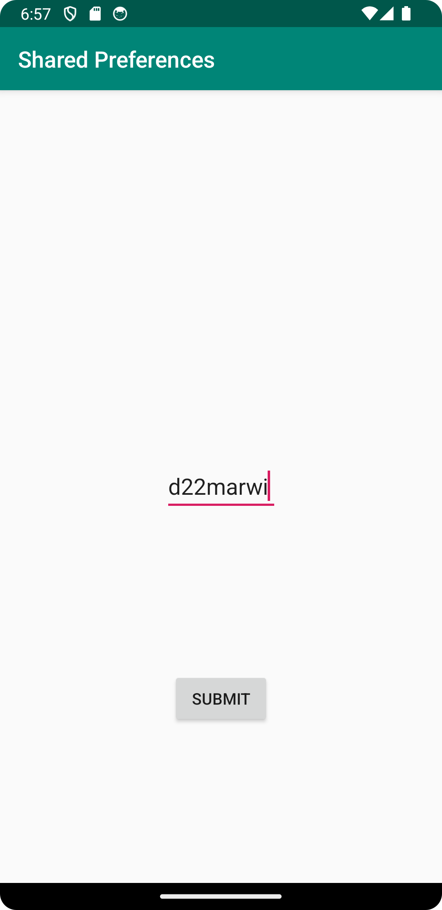
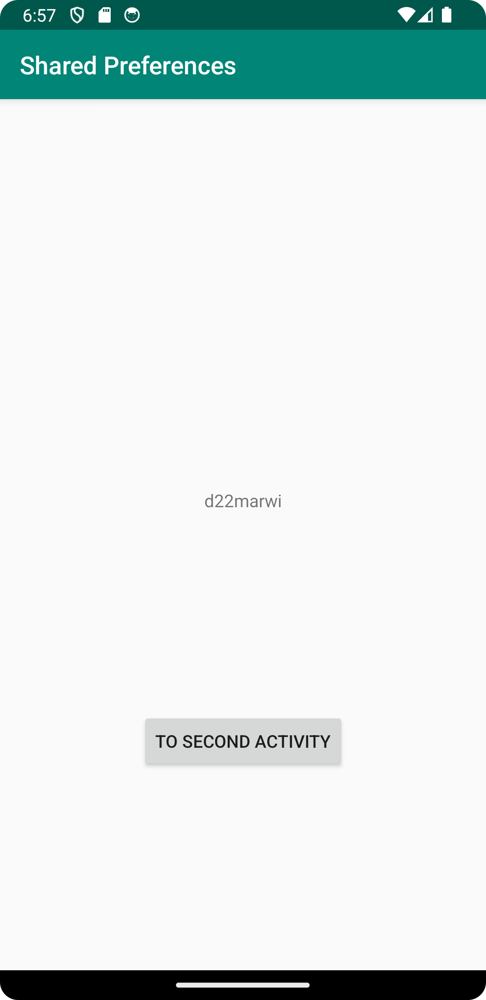

# Rapport

Jag började med att skapa den nya klassen som jag döpte till SecondActivity som uppgiftsbeskrivningen anger. 
Sedan lade jag till activity_second.xml för att implementera knapp och Edittext ruta, 
knappen är tillför att submit data mellan de olika aktiviteterna och EditText är där vi ska skriva data till shared preferenses.
Efter detta lade jag till en TextView och en knapp i activity_main.xml, 
knappen ska öppna SecondActivity och TextView ska skriva ut den data vi skrev i EditText i second_activity.
I MainActivity och SecondActivity implementerade jag variabler på följande vis:

```
public class MainActivity extends AppCompatActivity { 
 
    private SharedPreferences myPreferenceRef; 
    private SharedPreferences.Editor myPreferenceEditor; 
 
    @Override 
    protected void onCreate(Bundle savedInstanceState) { 
    ... 
        myPreferenceRef = getSharedPreferences("key", MODE_PRIVATE); 
        myPreferenceEditor = myPreferenceRef.edit(); 
 
        TextView prefTextRef= findViewById(R.id.my_textview); 
        prefTextRef.setText(myPreferenceRef.getString("key", "No preference found.")); 
       
    } 
```

Vi skapar en instans för SharedPereference och SharedPreference.Editor objekt. 
Min my_textview koppas till variabeln prefTextRef och setText tar datan ifrån myPreferenceRef och lagar den i prefTextRef som visas i textView.
Jag kopplat samman metoden store(); med EditText, datan som skrivs in kommer lagras och sparas i SharedPrefData.

```
void store() { 
    EditText sharedPrefData = findViewById(R.id.my_edittext); 
    myPreferenceEditor.putString("key", sharedPrefData.getText().toString()); 
    myPreferenceEditor.apply(); 
} 
```
Sedan kopplar jag samman min TextView med sharedPrefData. 
Sedan används setText för att hämta datan som finns lagrad i en Shared Precerence och visas i TextView.

```
@Override 
protected void onResume() { 
    super.onResume(); 
    TextView sharedPrefData = findViewById(R.id.my_textview); 
    sharedPrefData.setText(myPreferenceRef.getString("key", "Name")); 
} 
```




